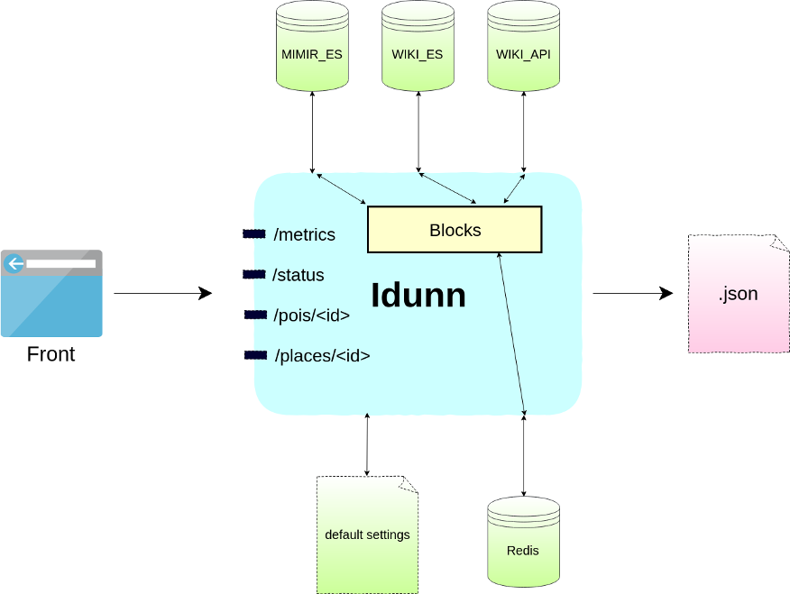

[](https://github.com/QwantResearch/idunn)
[](https://github.com/QwantResearch/idunn/blob/master/LICENSE)
[](https://hub.docker.com/r/qwantresearch/idunn/)

# Idunn

- Idunn is an API to get [points-of-interest](https://en.wikipedia.org/wiki/Point_of_interest) information for QwantMaps.
- The POIs are taken from the [mimir](https://github.com/CanalTP/mimirsbrunn) ElasticSearch database.
- It also fetches POI data from Wikipedia API and a custom Wikidata Elasticsearch source.
- Why [Idunn](https://fr.wikipedia.org/wiki/Idunn) ? Because she is the wife of [Bragi](https://fr.wikipedia.org/wiki/Bragi) that is also [the main](https://github.com/CanalTP/mimirsbrunn/tree/master/libs/bragi) mimir API.
- A simple workflow schema of Idunn is presented below.



## API

- The API provides its OpenAPI schema with:
`GET /schema`

The main endpoints are:
* `/v1/places/{place_id}?lang={lang}&type={type}&verbosity={verbosity}` to get the details of a place
(admin, street, address or POI).
    * `type`: (optional) parameter belongs to the set `{'admin', 'street', 'address', 'poi'}`
    * `verbosity` parameter belongs to the set `{'long', 'short'}`. The default verbosity is `long`.
* `/v1/places?bbox={bbox}&category=<category-name>&size={size}` to get a list of all points of interest matching the given bbox and categories
    * `bbox`: left,bot,right,top e.g. `bbox=2.0,48.0,3.0,49.0`
    * `category`: multiple values are accepted (e.g. `category=leisure&category=museum`)
    * `size`: maximum number of places in the response
    * `verbosity`: default verbosity is `list` (equivalent to `long`, except "information" and "wiki" blocks are not returned)
    * `source`: (optional) to force a data source (instead of automated selection based on coverage). Accepted values: `osm`, `pages_jaunes`
    * `q`: full-text query (optional, experimental) 
* `/v1/places?bbox={bbox}&raw_filter=class,subclass&size={size}` to get a list of all points of interest matching the given bbox (=left,bot,right,top e.g. `bbox=2,48,3,49`) and the raw filters (e.g. `raw_filter=*,restaurant&raw_filter=shop,*&raw_filter=bakery,bakery`)
* `/v1/categories` to get the list of all the categories you can filter on.
* `/v1/pois/{poi_id}?lang={lang}` is the **deprecated** route to get the details of a POI.
* `/v1/status` to get the status of the API and associated ES cluster.
* `/v1/metrics` to get some metrics on the API that give statistics on the number of requests received, the duration of requests... This endpoint can be scraped by Prometheus.

## Running

- The dependencies are managed with [Pipenv](https://github.com/pypa/pipenv).
- To run the api you need to do:
```shell
pipenv install
```
- and then:
```shell
IDUNN_MIMIR_ES=<url_to_MIMIR_ES> IDUNN_WIKI_ES=<url_to_WIKI_ES> pipenv run python app.py
```
- you can query the API on port 5000:
```shell
curl localhost:5000/v1/places/toto?lang=fr&type=poi
```

### Configuration

The configuration can be given from different ways:
 1. a default settings is available in utils/default_settings.yaml
 2. a yaml settings file can be given with an env var IDUNN_CONFIG_FILE
    (the default settings is still loaded and overriden)
 3. specific variable can be overriden with env var. They need to be given like "IDUNN_{var_name}={value}"
    eg IDUNN_MIMIR_ES=...

## How to contribute ?

- Idunn comes along with all necessary components to contribute as easily as possible: specifically you don't need to have any Elasticsearch instance running. Idunn uses [docker images](tests/docker-compose.yml) to simulate the Elasticsearch sources and the Redis. This means that you will need a local docker install to be able to spawn an ES cluster.

- To contribute the common workflow is:

	1. install the dev dependencies: `pipenv install --dev`
	2. add a test in `./tests` for the new feature you propose
	3. implement your feature
	4. run pytest: `pipenv run pytest -vv -x`
