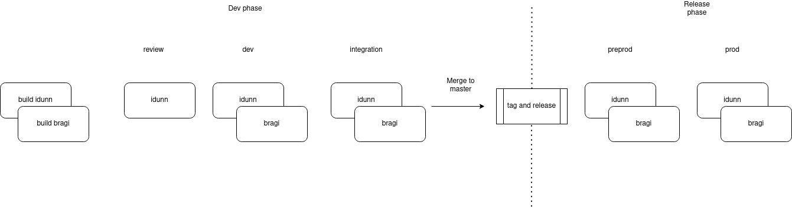

# Idunn

Deployment repository for [Idunn](https://github.com/qwant/idunn), Qwant Maps internal API for Points of Interest, Directions and more. 

## Documentation

A reference on available endpoints is available [here](https://maps.dev.qwant.ninja/maps/detail/redoc) ([alternative format](https://maps.dev.qwant.ninja/maps/detail/docs)).

Note that this documentation is bounded to the version available on the dev environment.

## CI notes on development and release process

Every branch can deploy to dev and integration using image sha. After the validation is completed use ci/scripts/release script to tag and release a version: this will trigger a pipeline where it will be possible to sync the argo apps repository.
